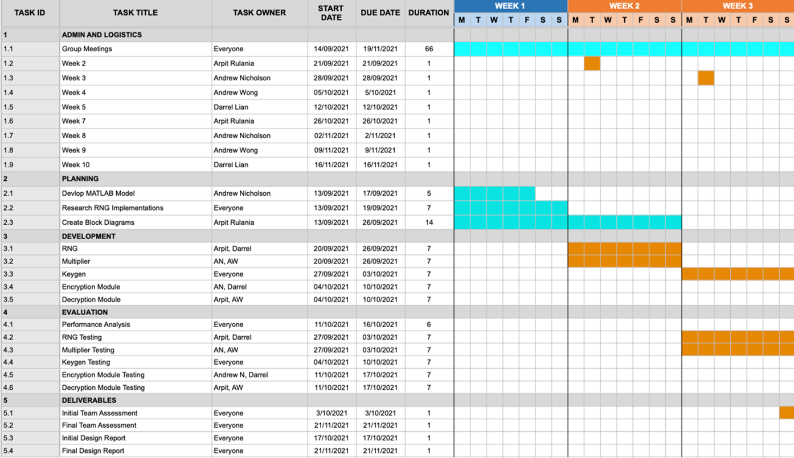
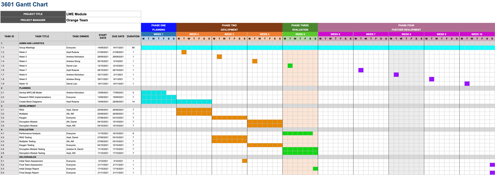
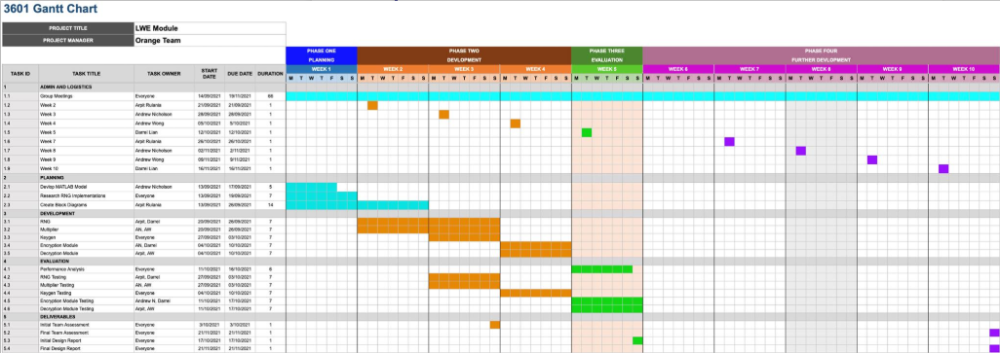
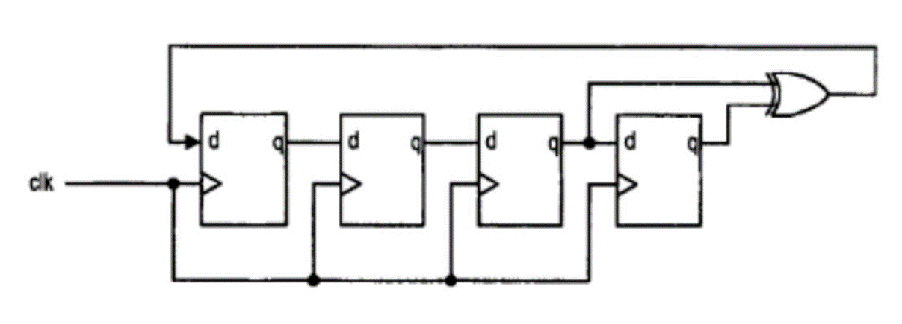
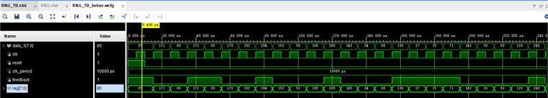
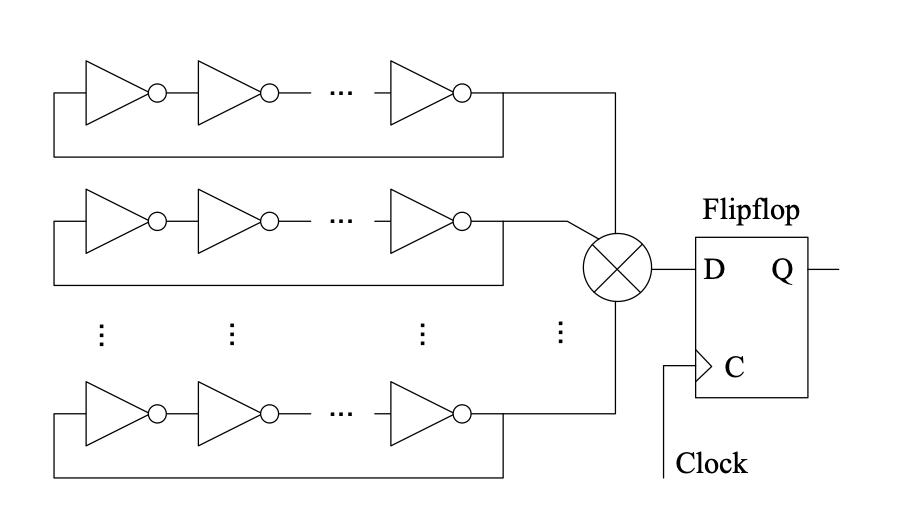
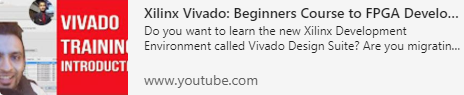



> Week 2 Progress Update

---

{}

## Progress This Week

---

## Changes to the Gantt Chart

* RNG implementation has been extended into week 3
* Multiplication pushed back as implementation was discussed in Thursday lecture
* Need for a modulo function
* Need to generate prime numbers
* More research needed to be conducted in week 2 than anticipated

{}

---

## Random Number Generator

{}

> Current Implementation

Linear Feedback Shift Register

* Pseudo-random
* Uses a chain of D-Type flip-flops
* Output is XOR'd and used as input feedback

---

> Implementation Result

---

> Alternative (P)RNG Methods

TRNG from Ring Oscillator and PRNG 

{}

---

## Current Research

* Synthesisable modulo operation
* Mersenne Primes
  * Required for generation of A matrix
  * 2N-1 not valid for all N
    * Still requires a check if prime
* Sampling and errors

---

## Lessons Learned

> Learning Vivado

> Learning VHDL

---


