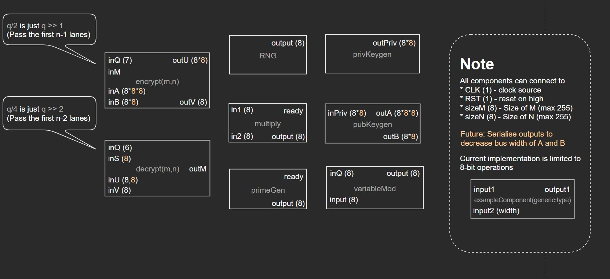



> Week 4 Progress Update 

---

## Schedule

Didn't get up to testing the RNG and Multiplier units.  
Testing extended to Week 4

---

## How Big?

specs

catering

---

## Modulo

{}

It works... but it's kinda slow...

> 128 % 2 takes 65 cycles  

---

Save some cycles!

> 128 % 2 now takes 15 cycles

---

9 cycles? How about 8?!

{}

---

## VHDL Blocks

{}
> BEFORE

---

> AFTER

{}

---

---


