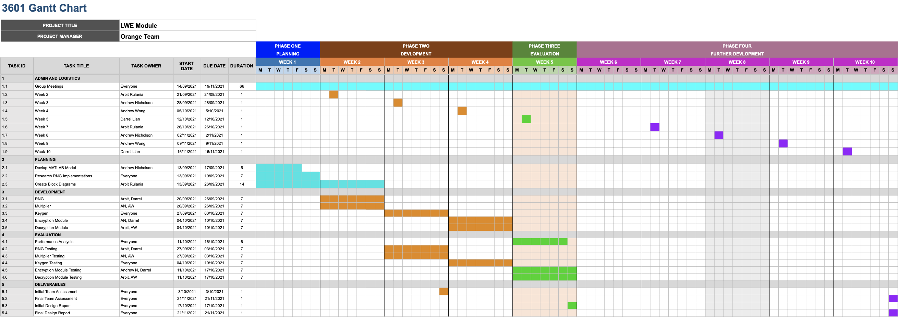
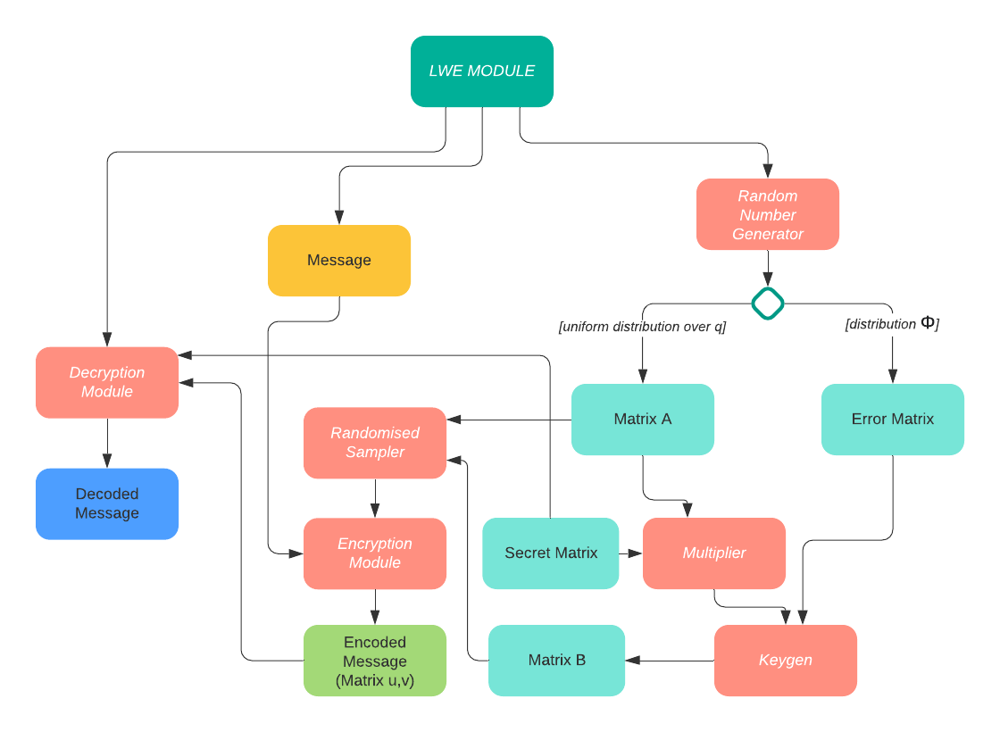

> COMP3601 21T2 Project

## Team Orange 🍊

* Andrew Nicholson
* Andrew Wong
* Arpit Rulania
* Ziyue Lian
  
---

## Table of Contents

* Task Breakdown
* Gantt Chart
* Progress made over the past week
* Tasks for upcoming weeks

---

## The Team

|||
|:---|:---|
|Andrew Nicholson|3rd Year ElecEng / CompSci|
|Andrew Wong|4th Year CompEng|
|Arpit Rulania|3rd Year CompEng|
|Ziyue Lian|4th Year CompEng|

---

## Task Breakdown

* Random Number Generator
* Multiplier
* Keygen Module
* Encryption Module
* Decryption Module

---

## Gantt Chart

---

## Progress Made So Far

* Matlab model of LWE completed
* Gantt chart made
* Project broken down into manageable tasks
* Research

---

## Block Diagram

---

## Future Tasks

* Research methods of implementation.
* Create FSMs for different modules.
* Start rough implementations in VHDL.
* Finish RNG in the next week.

---



# Thank You!