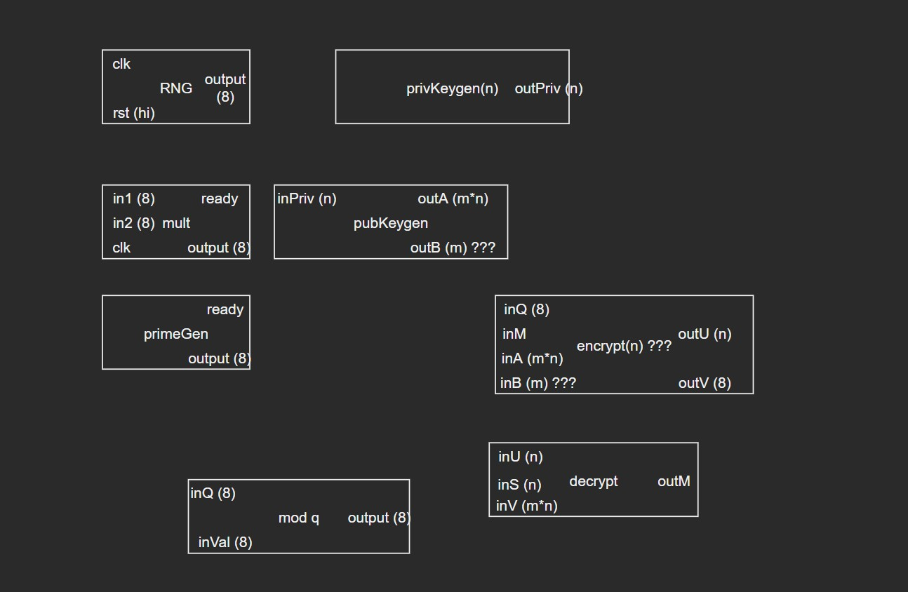
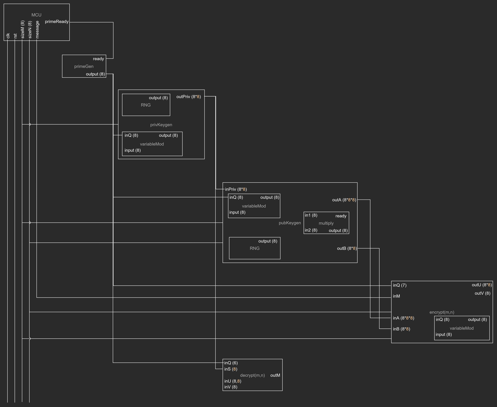
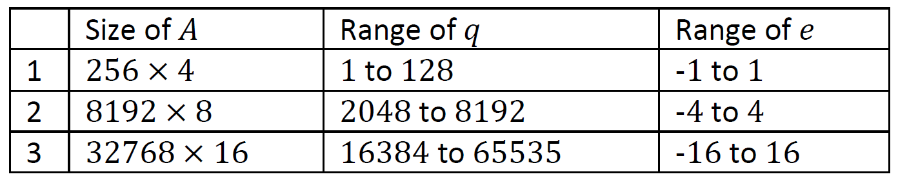
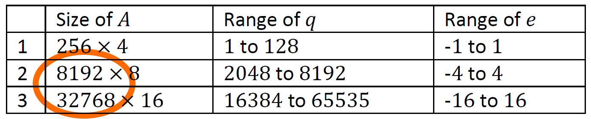
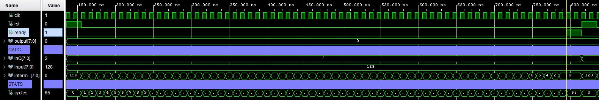
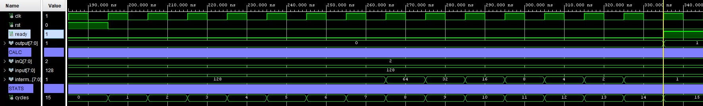
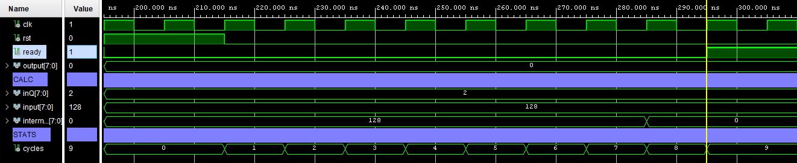
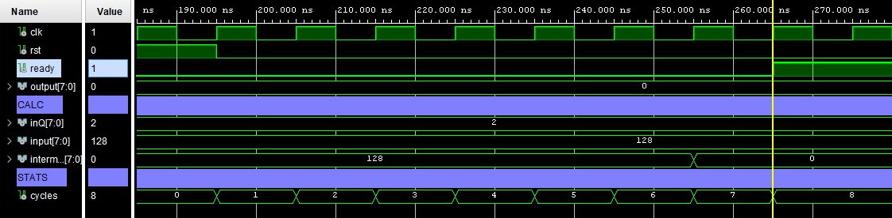
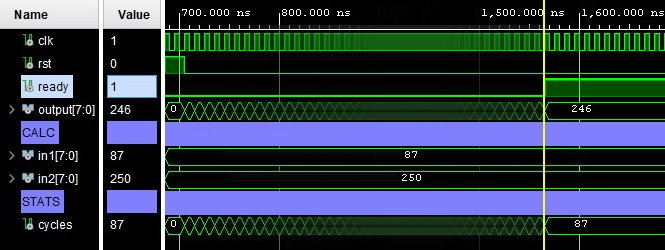
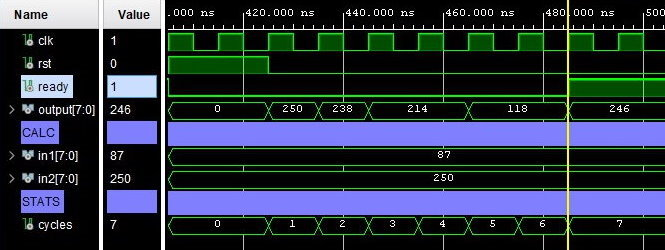



> Week 4 Progress Update 

---

## Schedule

Didn't get up to testing the RNG and Multiplier units.  
Testing extended to Week 4

---

## VHDL Components

{}
> BEFORE

{} Fleshed out the specifications for the components {}

---

> AFTER

{} In that process, we also identified a few possible issues and overheads that would make the logic area large {}

{}

---

## Connection Diagram

---

## How Big?

{} 

As per the project spec, the design needs to validate the provided configurations.

> Does the design stay the same for all three configurations?

---

Our current design only supports up to 8-bit values.  

> We need to support $q = 65535$  
which is a 16-bit value.

🟧 TODO

---

Public key A gets quite big...

We probably don't want to transmit $32768 \times 16 \times 16 \times 16$ bits at once...  

Instead, transmit $16 \times 16 \times 16$ bits $32768$ times?

{}

---

## Modulo

{}

It works... but it's kinda slow...

> 128 % 2 takes 65 cycles  

---

Save some cycles!

> 128 % 2 now takes 15 cycles

---

9 cycles? How about 8!

{}

---

## Multiplier

<part>

> Before

$87 \times 250$ in $87$ cycles

</part>

<part>

> After

$87 \times 250$ in $7$ cycles

</part>

🟧 TODO: Approximate Multipliers

---


