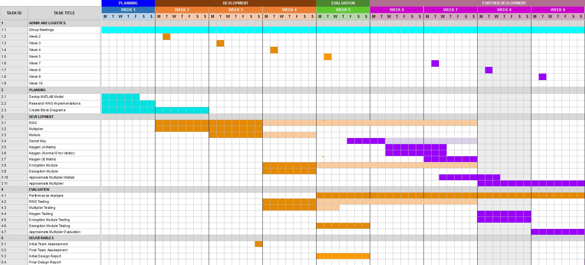



> Week 5 Progress Update

---

## Schedule

---

## Matlab

> [[MATLAB Analysis]](https://featherbear.cc/unsw-comp3601-project/matlab-model/#/1)

{} PSA: MATLAB isn't a coding language - Andrew Wong {}

---

## Decryption Module

* Designed like a state machine
* Optimisation: Subtract q/4 from all sides of the inequality
  * Allows a simpler (faster!) comparison of `D < q/2`

---

## Updated Components

Updated port definitions to limit `n`

{}

OLD  

---

NEW  

{}

---

## Report

Worked on the report

---

## Matrix Generation

---

## Moving Forwards

* Complete the encryption module
* Test different matrix generation modules
  * Check storage requirements and performance
* Read more about approximate multipliers

---


