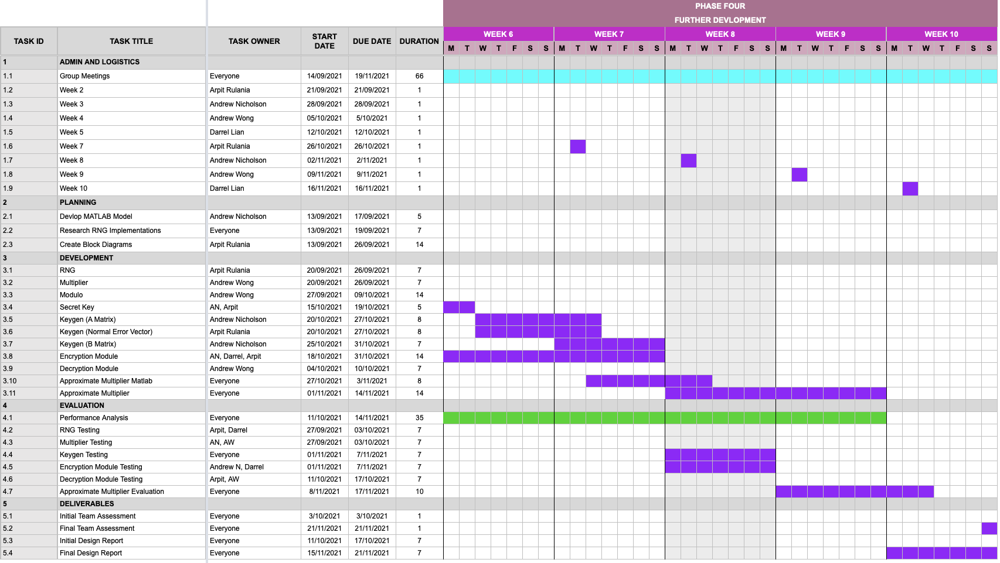
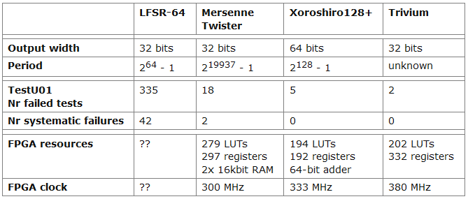
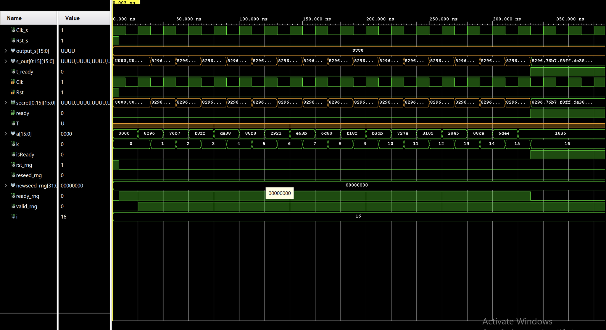
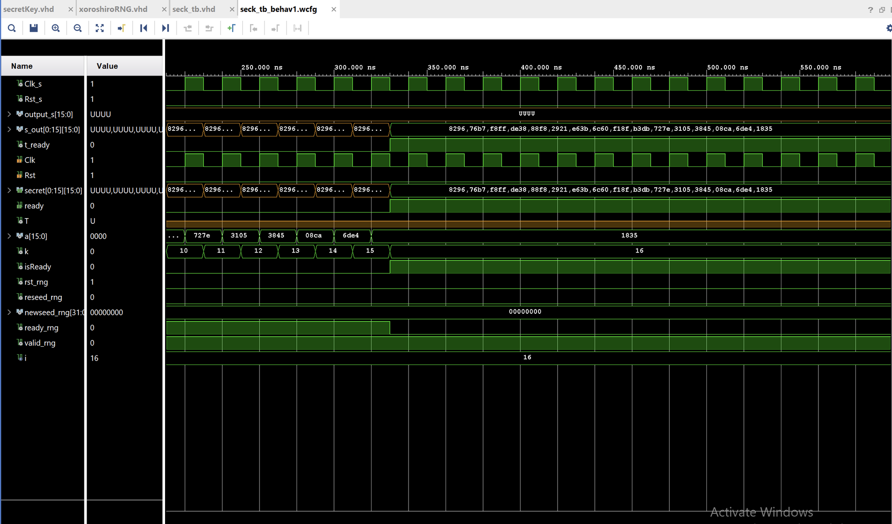



> Week 7 Progress Update

---

## Schedule

---

## Interfacing

> Streaming ASCII

* Sending messages between devices requires conversion
* The VHDL standard libraries can be used for text I/O
* Contents of a file on the sender's computer is extracted as bits and passed into the LWE system
* The file reader must sync to the clock of the MCU

---

## Xoroshiro RNG

{} 

> Optimisations for space

* Changing PRNG module from LFSR to Xoroshiro
* Better space efficiency
* Operations: XOR, Rotate, Shift, Rotate
* Pseudorandom number generator

---

---

> Further changes to RNG

* Ability to reseed RNG module
* C++ to be used to generate seed values
* Reworked secret key and public key matrix generators for new RNG module

---

---

{} 

---

## Dot Product

> Speeding things up

* Looked to change B matrix generation module
* Increased number of instantiated multiplication modules
* Uses generics to allow for different configurations
    * E.g. For a 16 column A matrix now uses 16 multiplier modules for parallelisation of the modules
* Reduces time taken to generate B matrix due to costliness of modulo operation

---

## Approximate Multiplier

> Trading errors for speed

* Translation of Verilog HDL to VHDL
* Looking for areas to increase space efficiencies
  * Example: for B matrix generation requires 16 instances
* Is enough space saved to warrant use over exact multiplier?
* Are the errors appropriate for LWE?

---

## Further Evaluation and Research

{} 

> Next steps

---

* Investigate effects of the approximate multiplier
* Look for further optimisations in existing systems
* Ensure all three specification requirements are met
* Compression of data for encoding and transmission
* Large amount of data required for each bit of message, how can this be improved?
* Verification of existing modules and integration of components

{} 

---



