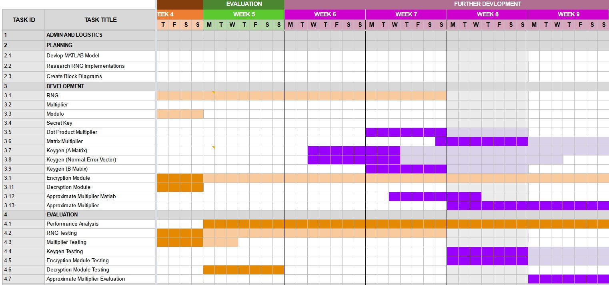



> Week 8 Progress Update

---

### Schedule

**Blocking -** Matrix Multiplication

---

### Development of the MCU

* Main Control Unit created to co-ordinate signals
* Two operating modes
  * Encryption
  * Decryption

---

### Dot Product

> Next steps: Multiplier

---

### Approximate Multipliers

{}

> Speed, Space, Accuracy, Security

---

* Error corrections are useful (better approx.) but...
  * 1-1 mapped LUT is costly
* Binned EC values?
* Single average EC value?

    

        
        Uncorrected
    

    

        
        Corrected
    

---

> Future: Verification of acceptable error

* Consistency with error ratios for invalid keypairs
* Magnitude of importance

---

<small style="position:absolute; top: -20px; left: 0; right: 0;">e.g. Consistency with error ratios for invalid keypairs</small>
<iframe class="viz" src="//featherbear.github.io/UNSW-COMP3601/project/matlab/d_vals_badS.html"></iframe>

---

<small style="position:absolute; top: -20px; left: 0; right: 0;">e.g. Magnitude of importance</small>
<iframe class="viz" src="//featherbear.github.io/UNSW-COMP3601/project/matlab/log_m45,n65,qTO157.html"></iframe>

* [Cryptographic Integrity 1](https://featherbear.cc/unsw-comp3601-project/matlab-model/#/5)
* [Cryptographic Integrity 2](https://featherbear.cc/unsw-comp3601-project/matlab-model/#/9)

{}

---

### Optimising the Encryption Stage

{}

> Issue: Current row selection is biased

i.e 10% selection chance / 90% not selected

* Next item has 10% x 90% = 9% chance of selection
* Next item has 10% x 81% = 8.1% chance of selection

* Non-uniform = higher chance of set reuse
* Not cryptographically secure!

---

###### <u>Proposal</u>

Select the sampled rows prior to calling the encryption module, and pass in only the required data

* Possible mitigation of side-channel timing attack?

{}

---



